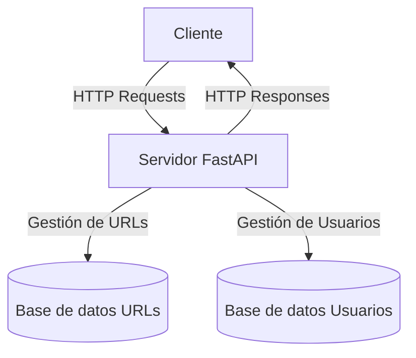

# URL Shortener con FastAPI

Este proyecto es un acortador de URLs implementado con FastAPI en el backend.

## Características principales

- Acortamiento de URLs
- Gestión de usuarios
- API RESTful
- Uso de dos bases de datos separadas para URLs y usuarios

## Arquitectura

El siguiente diagrama muestra la arquitectura cliente-servidor de nuestro sistema:

### Explicación del diagrama

- El cliente envía solicitudes HTTP al servidor FastAPI.
- El servidor FastAPI procesa estas solicitudes y realiza operaciones en las bases de datos según sea necesario.
- Hay dos bases de datos separadas:
  1. Base de datos de URLs: Almacena las URLs originales y sus versiones acortadas.
  2. Base de datos de Usuarios: Almacena la información de los usuarios registrados.
- El servidor envía respuestas HTTP de vuelta al cliente.
